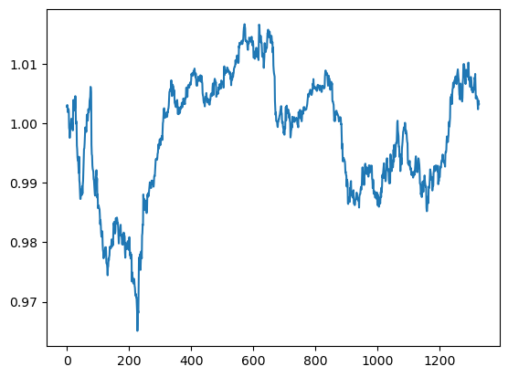

# Ornstein-Uhlenbeck-statistical-arbitrage
three main features of statistical arbitrage strategies:

- ‘trading signals are systematic, or rule-based, as opposed to driven by fundamentals’
- ‘the trading book is market-neutral, in the sense that it has zero beta with the market’
- ‘the mechanism for generating excess returns is statistical’

This repository was based upon a paper by Marco Avallaneda and Jeong-Hyun Lee called Statistical Arbitrage in the US Equities market

The paper describes the application of Ornstein-Uhlenbeck process for modelling the cointegration residual (spread) in statistical arbitrage strategies. Statistical arbitrage is basically a generalized version of pairs trading, where instead of trading one stock against another stock, we trade one portfolio of stocks agains another portfolio of stocks.

The approach can be summarised in the following steps
1) Describe asset returns using a statistical model
2) Modelling the residual as a mean reverting ornstein-uhlenbeck process
3) Generate trading-signals if the residual is likely to mean revert

1.Decomposing returns based on factor based asset model
----- 

based on the paper by Avalanda and Lee (2008) I will use the following SDE to model the asset returns:
$$\frac{dS_i(t)}{S_i(t)}=\alpha_i dt+\displaystyle\sum_{i=1}^N{\beta_{ij}\frac{dI_j(t)}{I_j(t)}}+dX_i(t)$$

where the term $\displaystyle\sum_{i=1}^N{\beta_{ij}\frac{dI_j(t)}{I_j(t)}}$ represents the systematic component, in this model eigenportfolio's are used. An eigenportfolio can be computed by taking the covariance matrix of all assets and decomposing it's spectrum by finding the eigenvalues and eigenvectors of the matrix. The biggest eigenvalue represents the underlying factor which best describes the variance in the respective returns of all assets. This biggest eigenvector can be thought of as representing the underlying market, in this implementation I use the first x-amount of eigenportfolios and i pick them such that their total variance accounts for at least 55% of the variance of all returns.

An example of an asset DOGECOIN in this case and the respective eigenportfolio's at 55% cutoff

the idiosyncratic component is $\alpha_i dt + dX_i(t)$

in this section i will explore ways to find the appropriate Beta's and to isolate the idiosyncratic component of the asset returns

The number of eigenportfolio's I will use to model the systematic component will be chosen such that 55% of the variance can be captured by the eigenportfolio's 

2.Fitting Ornstein-Uhlenbeck model to the data
------
In the paper by Avalanda and Lee (2008) the idiosyncratic component is assumed to be an Ornstein-Uhlenbeck process which can be modelled by the following SDE:
$$dX_i(t)=\kappa_i(m_i - X_i(t))dt+\sigma_idW_i(t)$$

This process is stationary and auto-regressive with lag 1
with $E[dX_i(t)|X_i(s),s\leq t]=\kappa_i(m_i-X_i(t))dt$

meaning the expected returns are positive or negative according to the sign of $m_i-X_i(t)$

Next up I wil fit the OU-model to our data incorporating the drift and constructing the s-score used in the paper

I will use 2 methods:
1) One based on linear regression using a method used by Avalanda and Lee (2008)
2) MLE discussed in the paper by Leung and LI (2015)

#### 1) Linear regression method
Assuming that the parameters of the OU-model are constant the model can discretized using following formula
$$X_i(t_{0} + \Delta t) = e^{- \kappa_i \Delta t} X_i(t_{0}) + m_i(1-e^{- \kappa_i \Delta t}) + \sigma_i \int_{t_{0}}^{t_{0}+\Delta t}{e^{- \kappa_i (t_{0}+\Delta t-s)}dW_i(s)}$$

Letting $\Delta t$ tend to infinity, the probability distribution of the process is normal with $E[X_i(t)] = m_i$ and $Var[X_i(t)] = \frac{\sigma_i^2}{2\kappa_i}$

using linear regression i try to fit the following discrete model
$X_{i+1} = a+ bX_{i} + \zeta_i$

from these predicted parameters i can find the OU-model parameters using the following equations:

$b = e^{- \kappa_i \Delta t}$

$m_i = a / (1-b)$]

$\sigma_i = \sqrt{Var[X_i(t)]\cdot2\kappa_i}$

$\sigma_{eq,i} = {\sigma_i}/{\sqrt{2\kappa_i}}$

$\tau_i = 1 / \kappa_i$ is the average time of reversal 
and this is a paramete which can be used as a cutoff for when to trade

#### 2) MLE method
This method for fitting the data is adapted from the paper: Optimal Mean Reversion Trading with transaction costs and stop-loss exit by Leung and Li (2008)

They propose fitting the Ornstein-Uhlenbeck model using a MLE method using the following Conditional probability density:
$$f^{OU}(x_i|x_{i-1};m_i, \kappa, \sigma) = \frac{1}{\sqrt{2\pi \tilde{\sigma}^2}} \exp(-\frac{(x_i - x_{i-1}e^{-\kappa \Delta t}-\theta (1- e^{-\kappa \Delta t}))^2}{2 \tilde{\sigma}^2})$$

with the constant $\tilde{\sigma}^2 = \sigma^2 (1-e^{-2\kappa \Delta t})/2\kappa$

Using the observed values $(x_i)_{i=1,...,n}$ we can maximise the average log-likelihood defined by:

$$\ell(\theta, \kappa, \sigma|x_{0},x_{1},....,x_{n}) := \frac{1}{n} \displaystyle\sum_{i=1}^n{ln(f^{OU}(x_i|x_{i-1};\theta, \kappa, \sigma))} 
=\frac{1}{2}ln(2\pi) - ln(\tilde{\sigma}) - \frac{1}{2n\tilde{\sigma}^2} \displaystyle\sum_{i=1}^n{|(x_i - x_{i-1}e^{-\kappa \Delta t}-\theta (1- e^{-\kappa \Delta t}))|^2}$$

3.Generating buy and sell signals
------

S-score is a standardised value used in the strategy outlined in the paper by avalanda

$s_i = \frac{X_i(t)-m_i}{\sigma_{eq,i}}$

which can be adjusted to account for drift which i will do as well

$s_{mod,i} = s_i - \alpha_i / (\kappa_i \sigma_{eq,i})$

The drift can be interpreted as the slope of the moving average, I therefore have a built in momentum strategy in this indicator

Significant drawback of using this method for generating buy and sell signals is that a arbitrary cuttoff will be used when deciding when to buy or sell in the paper (Avalanda 2008) the following rule is used:

- buy to open if $s_i < -1.25$
- sell to close if $s_i > -0.5$

- sell to open if $s_i > 1.25$
- buy to open if $s_i < -0.75$

I will be using the values: -3, -1.5, 3 and 1.5 respectively 

Figure below shows an example timeseries of these s-scores the modified s-score takes into account the drift of the idiosyncratic part

4.Backtests and results:
------
I have performed two backtests on 18 months of 15-minute candlestick data provided by Binance. I will discuss the results of the backtest here.
#### 1) No transaction costs  

Backtest came back very positive with high returns and very little drawdowns some results:

|    |      Results      |
|----------|:-------------:|
| Total trades |  674 |
| Hitrate |    53.85%   |
| average win | 41.08 | 
| average loss| -24.13 |
| total stop losses | 358 | 
| Total take profits | 316 | 
| Annualised sharpe | 3.80 | 

#### 2) Adding transaction costs 

Unfortunately once I add transaction costs of 0,1% to the backtest the results are only negative

|    |      Results      |
|----------|:-------------:|
| Total trades |  674 |
| Hitrate |    45.40%   |
| average win | 9.17 | 
| average loss| -8.85 |
| total stop losses | 358 | 
| Total take profits | 316 | 
| Annualised sharpe | -1.23 | 

5.Conclusion
------
The model clearly does contain some alpha even though it is very small on these timescales. 
I could make some changes like increase the timeframe on which the model trades from 15 minutes to daily returns, perhaps on these longer timeframes the moves are larger and the performance of the strategy is less affected by transaction costs. On the other hand reducing transaction costs sufficiently might be an option as well.

## OU-statistical arbitrage revisited 

To adress the previous issues I attempted to resolve them in 4 ways:
- Use a feedforward neural network to assign the weights instead of the naive threshold system
- Lower transaction costs from 0.1% to 0.01% by trading futures instead of the spot market on binance
- Include the transaction costs while fitting the model
- Lower the trade frequency from 15 mins to 6h

The feedforward neural network is a function $\mathbb{R}^4 \rightarrow \mathbb{R}$:
$$
(X_t, \mu, \sigma, R^2) \rightarrow \mathbb{R}
$$
As a objective functions multiple approaches are suggested in "Deep Learning Statistical arbitrage" in this implementation i will use the expected sharpe accounting for transaction costs

$$\max_{\mathbf{w}^{\mathbf{\epsilon}} \in \mathbf{W}, \mathbf{\theta} \in \mathbf{\Theta}} \frac{\mathop{\mathbb{E}}[{w_{t-1}^{R}}^{\top} R_t]}{\sqrt{Var[{w_{t-1}^{R}}^{\top} R_t]}}$$

Unfortunately out of sample I have not been able to make this a profitable strategy with a sharpe 0.11 it performs quite bad out of sample though while in sample the same configuration got a sharpe around 1.

Conclusion is that while in 2020-2021 the strategy would be profitable stat-arb does not perform well after this period, either due to different market conditions or because all stat-arb opportunities are already utilised.
