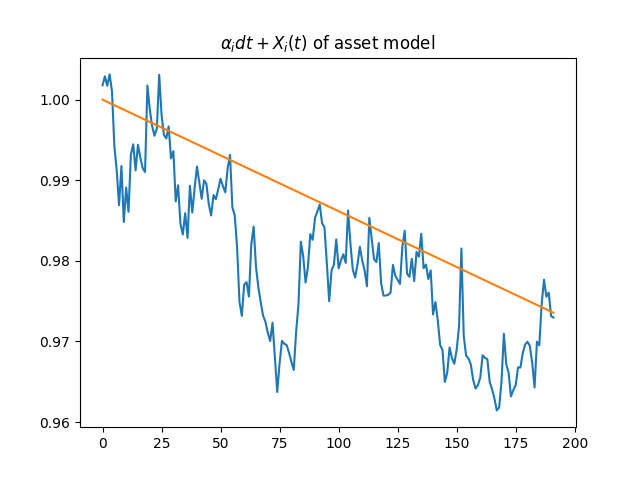
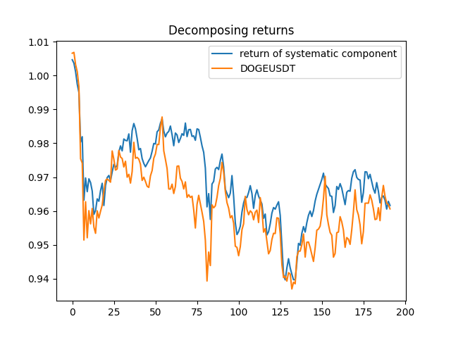
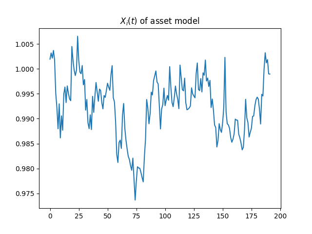
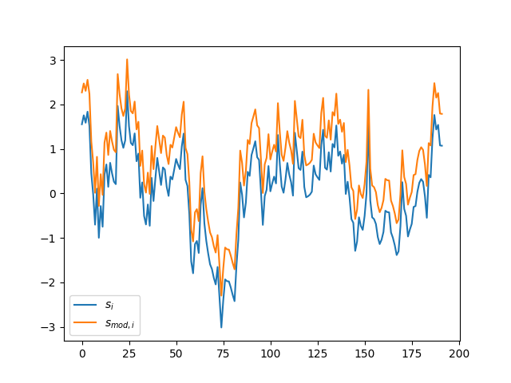
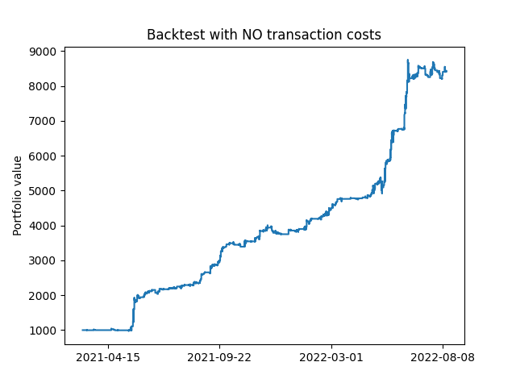
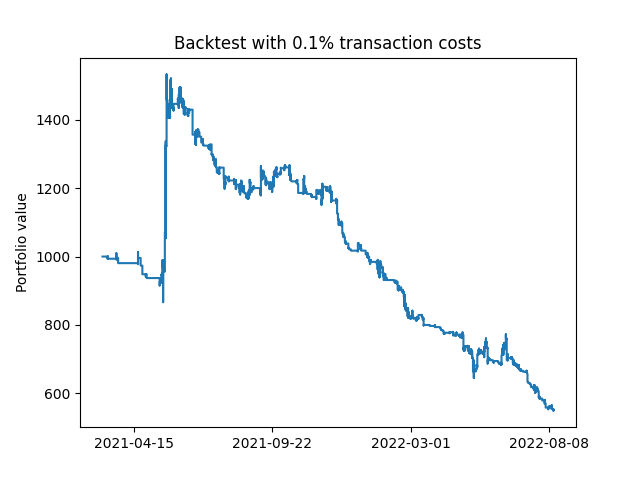

# Ornstein-Uhlenbeck-statistiscal-arbitrage

This repository was based upon a paper by Marco Avallaneda and Jeong-Hyun Lee called Statistical Arbitrage in the US Equities market

Decomposing returns based on factor based asset model
----- 

based on the paper by Avalanda and Lee (2008) I will use the following SDE to model the asset returns:
$$\frac{dS_i(t)}{S_i(t)}=\alpha_i dt+\displaystyle\sum_{i=1}^N{\beta_{ij}\frac{dI_j(t)}{I_j(t)}}+dX_i(t)$$

where the term $\displaystyle\sum_{i=1}^N{\beta_{ij}\frac{dI_j(t)}{I_j(t)}}$ represents the systematic component, in this model the eigenportfolio's are used

the idiosyncratic component is $\alpha_i dt + dX_i(t)$

in this section i will explore ways to find the appropriate Beta's and to isolate the idiosyncratic component of the asset returns

The number of eigenportfolio's I will use to model the systematic component will be chosen such that 55% of the variance can be captured by the eigenportfolio's 

this way i don't use a fixed number of eigenvalues

An example of an asset DOGECOIN in this case and the respective eigenportfolio's at 55% cutoff

Fitting Ornstein-Uhlenbeck model to the data
------
In the paper by Avalanda and Lee (2008) the idiosyncratic component is assumed to be an Ornstein-Uhlenbeck process which can be modelled by the following SDE:
$$dX_i(t)=\kappa_i(m_i - X_i(t))dt+\sigma_idW_i(t)$$

This process is stationary and auto-regressive with lag 1
with $E[dX_i(t)|X_i(s),s\leq t]=\kappa_i(m_i-X_i(t))dt$

meaning the expected returns are positive or negative according to the sign of $m_i-X_i(t)$

Next up I wil fit the OU-model to our data incorporating the drift and constructing the s-score used in the paper

I will use 2 methods:
1) One based on linear regression using a method used by Avalanda and Lee (2008)
2) MLE discussed in the paper by Leung and LI (2015)

#### 1) Linear regression method
Assuming that the parameters of the OU-model are constant the model can discretized using following formula
$$X_i(t_{0} + \Delta t) = e^{- \kappa_i \Delta t} X_i(t_{0}) + m_i(1-e^{- \kappa_i \Delta t}) + \sigma_i \int_{t_{0}}^{t_{0}+\Delta t}{e^{- \kappa_i (t_{0}+\Delta t-s)}dW_i(s)}$$

Letting $\Delta t$ tend to infinity, the probability distribution of the process is normal with $E[X_i(t)] = m_i$ and $Var[X_i(t)] = \frac{\sigma_i^2}{2\kappa_i}$

using linear regression i try to fit the following discrete model
$X_{i+1} = a+ bX_{i} + \zeta_i$

from these predicted parameters i can find the OU-model parameters using the following equations:

$b = e^{- \kappa_i \Delta t}$

$m_i = a / (1-b)$]

$\sigma_i = \sqrt{Var[X_i(t)]\cdot2\kappa_i}$

$\sigma_{eq,i} = {\sigma_i}/{\sqrt{2\kappa_i}}$

$\tau_i = 1 / \kappa_i$ is the average time of reversal 
and this is a paramete which can be used as a cutoff for when to trade

#### 2) MLE method
This method for fitting the data is adapted from the paper: Optimal Mean Reversion Trading with transaction costs and stop-loss exit by Leung and Li (2008)

They propose fitting the Ornstei-Uhlenbeck model using a MLE method using the following Conditional probability density:
$$f^{OU}(x_i|x_{i-1};m_i, \kappa, \sigma) = \frac{1}{\sqrt{2\pi \tilde{\sigma}^2}} \exp(-\frac{(x_i - x_{i-1}e^{-\kappa \Delta t}-\theta (1- e^{-\kappa \Delta t}))^2}{2 \tilde{\sigma}^2})$$

with the constant $\tilde{\sigma}^2 = \sigma^2 (1-e^{-2\kappa \Delta t})/2\kappa$

Using the observed values $(x_i)_{i=1,...,n}$ we can maximise the average log-likelihood defined by:

$$\ell(\theta, \kappa, \sigma|x_{0},x_{1},....,x_{n}) := \frac{1}{n} \displaystyle\sum_{i=1}^n{ln(f^{OU}(x_i|x_{i-1};\theta, \kappa, \sigma))} 
=\frac{1}{2}ln(2\pi) - ln(\tilde{\sigma}) - \frac{1}{2n\tilde{\sigma}^2} \displaystyle\sum_{i=1}^n{|(x_i - x_{i-1}e^{-\kappa \Delta t}-\theta (1- e^{-\kappa \Delta t}))|^2}$$

Generating buy and sell signals
------

S-score is a standardised value used in the strategy outlined in the paper by avalanda

$s_i = \frac{X_i(t)-m_i}{\sigma_{eq,i}}$

which can be adjusted to account for drift which i will do as well

$s_{mod,i} = s_i - \alpha_i / (\kappa_i \sigma_{eq,i})$

The drift can be interpreted as the slope of the 1000 moving average, we therefore have a built in momentum strategy in this indicator

Significant drawback of using this method for generating buy and sell signals is that a arbitrary cuttoff will be used when deciding when to buy or sell in the paper (Avalanda 2008) the following rule is used:

- buy to open if $s_i < -1.25$
- sell to close if $s_i > -0.5$

- sell to open if $s_i > 1.25$
- buy to open if $s_i < -0.75$

I will be using the values: -3, -1.5, 3 and 1.5 respectively 

Figure below shows an example timeseries of these s-scores the modified s-score takes into account the drift of the idiosyncratic part

Backtests and results:
------

